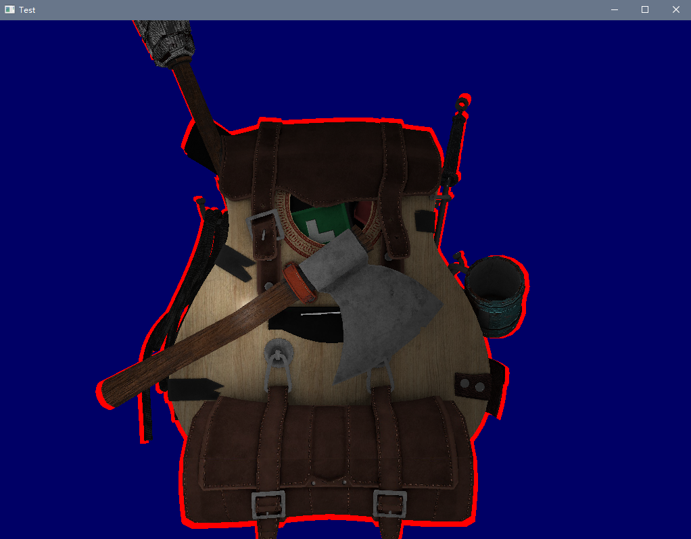
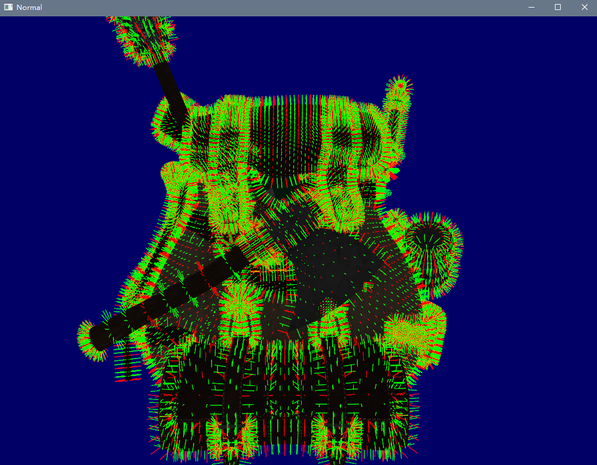
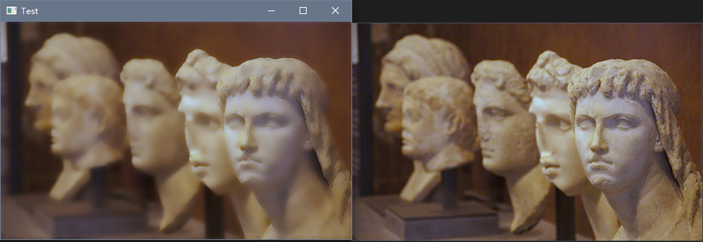

# OpenGL Template

  


一个没有其他外部依赖的OpenGL程序模板。起因是在不同平台重复配置相关依赖项过于繁琐，故使用CMake创建了一个多平台可用的模板，并对部分常用功能进行了封装。同时实现了简单的将图片、shader等资源嵌入可执行程序的功能。

具体使用可以参考`./example`目录下的相关例子。

## 编译

### Windows(Mingw)

```powershell
git submodule update --init
mkdir build
cd build
cmake .. -G "MinGW Makefiles"
make
```

### Windows(Visual Studio 2017及以上)

1. 选择菜单`文件`->`打开`->`CMake`，选择项目根目录的CMakeLists.txt，等待文件索引完成。

2. 选择菜单`CMake`->`全部生成`

### Linux

```bash
git submodule update --init
mkdir build
cd build
cmake ..
make
```

### OSX

github action编译可以通过，但由于没有相关设备，未经过实机测试。

## 第三方库

1. [assimp](https://github.com/assimp/assimp): The official Open-Asset-Importer-Library Repository.

2. [bin2c](https://github.com/gwilymk/bin2c): A very simple utility for converting a binary file to a c source file.

3. [glew-cmake](https://github.com/Perlmint/glew-cmake): GLEW is a cross-platform open-source C/C++ extension loading library.

4. [glfw](https://github.com/glfw/glfw): A multi-platform library for OpenGL, OpenGL ES, Vulkan, window and input.

5. [glm](https://github.com/g-truc/glm): GLM is a header only C++ mathematics library for graphics software based on the OpenGL Shading Language (GLSL) specifications.

6. [imgui](https://github.com/ocornut/imgui): ImGui is a bloat-free graphical user interface library for C++.

7. [mango](https://github.com/t0rakka/mango): A multi-platform low-level development framework for graphics programmers.

## 相关文档

1. [Quaternion proof](http://graphics.stanford.edu/courses/cs348a-17-winter/Papers/quaternion.pdf)

2. [What are the different texture maps for](https://help.poliigon.com/en/articles/1712652-what-are-the-different-texture-maps-for)

## 截图






